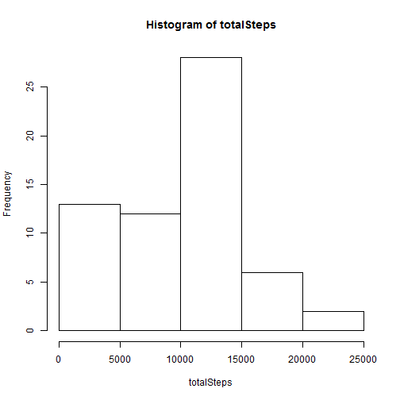
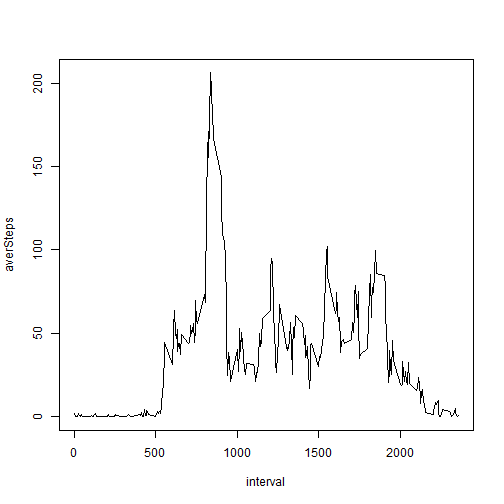
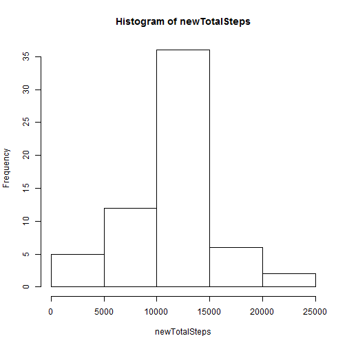

This is my final version of PeerAssessment 1.

First, I load the data and summary on data as follows: 


```r
setwd("Z:\\r\\RepData_PeerAssessment1")
activity<-read.csv("activity.csv")
str(activity)
```

```
## 'data.frame':	17568 obs. of  3 variables:
##  $ steps   : int  NA NA NA NA NA NA NA NA NA NA ...
##  $ date    : Factor w/ 61 levels "2012-10-01","2012-10-02",..: 1 1 1 1 1 1 1 1 1 1 ...
##  $ interval: int  0 5 10 15 20 25 30 35 40 45 ...
```

Question 1:What is mean total number of steps taken per day?

  Calculate the total number of steps taken per day:


```r
totalSteps<-c()
for (i in levels(activity$date)){
    totalSteps<-c(totalSteps,sum(activity[activity$date==i,"steps"],na.rm=TRUE))
}
totalSteps
```

```
##  [1]     0   126 11352 12116 13294 15420 11015     0 12811  9900 10304
## [12] 17382 12426 15098 10139 15084 13452 10056 11829 10395  8821 13460
## [23]  8918  8355  2492  6778 10119 11458  5018  9819 15414     0 10600
## [34] 10571     0 10439  8334 12883  3219     0     0 12608 10765  7336
## [45]     0    41  5441 14339 15110  8841  4472 12787 20427 21194 14478
## [56] 11834 11162 13646 10183  7047     0
```
  
  Make a histogram of the total number of steps taken each day:


```r
hist(totalSteps)
```

 

  Calculate and report the mean and median of the total number of steps taken per day:


```r
mean(totalSteps,na.rm=TRUE)
```

```
## [1] 9354.23
```

```r
median(totalSteps,na.rm=TRUE)
```

```
## [1] 10395
```

Question 2:What is the average daily activity pattern?
 
  Make a time series plot (i.e. type = "l") of the 5-minute interval (x-axis) and the average number of steps taken, averaged across all days (y-axis):


```r
averSteps<-c()
for (j in unique(activity$interval)){
    averSteps<-c(averSteps,mean(activity[activity$interval==j,"steps"],na.rm=TRUE))
    ##For this part, I also ignored missing values when calculating mean.
}
plot(unique(activity$interval),averSteps,type="l",xlab="interval")
```

 

  Which 5-minute interval, on average across all the days in the dataset, contains the maximum number of steps?

From the plot, it's easy to figure out that 104th 5-minute interval contains the maximum number of steps.

Question 3:Imputing missing values

  Calculate and report the total number of missing values in the dataset (i.e. the total number of rows with NAs):
  

```r
sum(is.na(activity$steps))
```

```
## [1] 2304
```

There are in total 2304 missing values in the dataset.

  Devise a strategy for filling in all of the missing values in the dataset.

For this part, I decide to replace all the missing values by the mean for that 5-minute interval.

  Create a new dataset that is equal to the original dataset but with the missing data filled in.
  

```r
newactivity<-activity
for( i in levels(activity$date)){
    for(j in unique(activity$interval)){
        if(is.na(activity[activity[,"date"]==i & activity[,"interval"]==j,"steps"])){
           newactivity[newactivity[,"date"]==i & newactivity[,"interval"]==j,"steps"]<-averSteps[match(j,activity$interval)] 
        }
    }
}
```

  Make a histogram of the total number of steps taken each day and Calculate and report the mean and median total number of steps taken per day. Do these values differ from the estimates from the first part of the assignment? What is the impact of imputing missing data on the estimates of the total daily number of steps?
  

```r
newTotalSteps<-c()
for (i in levels(newactivity$date)){
    newTotalSteps<-c(newTotalSteps,sum(newactivity[newactivity$date==i,"steps"]))
}
hist(newTotalSteps)
```

 

```r
mean(newTotalSteps)
```

```
## [1] 10766.19
```

```r
median(newTotalSteps)
```

```
## [1] 10766.19
```

From the result, both of the mean and median are 10766.19. It's obvious to know that these values differ from each other.For mean, it is caculated by amount of steps divided by total number of days.since we replace missing values by mean of that 5-minute interval.It's kind of adding more values to total number of steps with the number of days fixed.so new mean will be larger than before.For median, in previous part, we sort on a relatively smaller sets,then get the value in the middle. After we add some values into missing values, first, the set is larger, and it's reordered.so value in the middle changes.Above all, imputting missing data make the dataset more complete, and it adds more certainty into the dataset for future analysis.

Question 4:Are there differences in activity patterns between weekdays and weekends?

  Create a new factor variable in the dataset with two levels - "weekday" and "weekend" indicating whether a given date is a weekday or weekend day.
  

```r
isWeekday<-c()
for(k in levels(newactivity$date)){
    isWeekday<-c(isWeekday,ifelse(weekdays(as.Date(k)) %in% c("Saturday","Sunday"),"weekend","weekday"))
}
isweekday<-rep(isWeekday,each=288)
newactivity<-cbind(newactivity,isweekday)
```

  Make a panel plot containing a time series plot (i.e. type = "l") of the 5-minute interval (x-axis) and the average number of steps taken, averaged across all weekday days or weekend days (y-axis). 
  

```r
##caculate average number of steps taken respectively on weekday and weekend
weekdayAverSteps<-c()
for (j in unique(newactivity$interval)){
    weekdayAverSteps<-c(weekdayAverSteps,mean(newactivity[newactivity$interval==j & isweekday=="weekday","steps"]))
}
weekendAverSteps<-c()
for (j in unique(newactivity$interval)){
    weekendAverSteps<-c(weekendAverSteps,mean(newactivity[newactivity$interval==j & isweekday=="weekend","steps"]))
}
##panel plot
library(lattice)
panelPlot<-data.frame(asteps=c(weekdayAverSteps,weekendAverSteps),interval=rep(unique(newactivity$interval),times=2),weekday=rep(c("weekday","weekend"),each=288))
xyplot(asteps~interval|weekday,data=panelPlot,ylab="Number of steps",type="l",layout=c(1,2))
```

 
